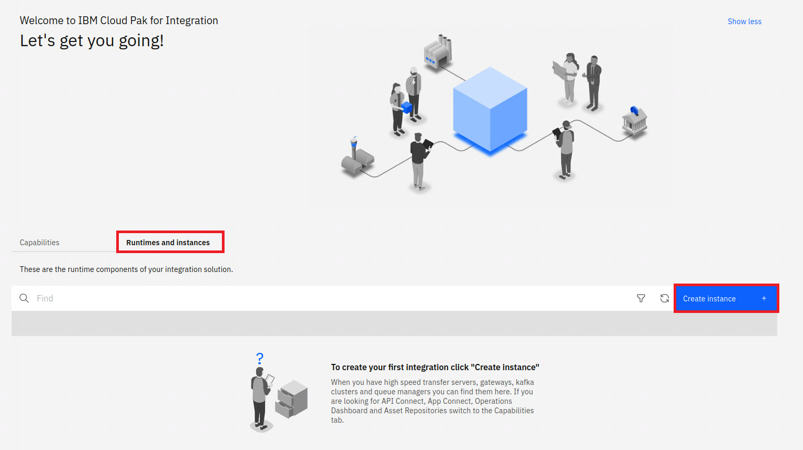

# Deploying IBM MQ for internal consumers

1. Within the Cloud Pak for Integration Platform Navigator click on Runtimes, and select Create Instance:  
   
1. Select the MQ Queue Manager tile:  
   
1. Select the _Quick start_ tile and click _Next_
1. Accept the license and and click _Create_ to deploy a new Queue Manager:  
   
1. You will be returned to the Runtime and Instances list, MQ will take a few seconds to deploy and the status will change to _Ready_. You may need to refresh the status by using the table refresh button:  
   
1. Select the newly created entry and you will be redirected to the MQ Console:  
   
1. Click on the manage button from the left menu to view the details of the Queue Manager:  
   
1. We will test MQ by sending a message to a queue, for this a new queue will be created, click on _Create +_:  
   
1. Select the _Local_ queue type:  
   
1. Fill in _app1_ as the Queue Name and click _Create_:  
   
1. A MQ channel needs to be defined for communication into MQ, select the _Communication_ tab, _App channels_ section and click _Create +_:  
   
1. Click _Next_
1. Enter _QUICKSTART_ as the channel name (as this will match the Queue Manager), and click _Create_:  
   
1. By default MQ is secure and will block all communication without explicit configuration.
   We will allow all communication for the newly created channel. Click on _Configuration_ in the top right:  
    
1. Select the _Security_ tab, _Channel authentication_ section and click _Create +_:  
   
1. We will create a channel auth record that blocks nobody and allows everyone. Select _Block_ from the pull down, and the _Final assigned user ID_ tile:  
   
1. Enter the following value:
   - Channel name: _QUICKSTART_
   - User list: nobody
1. Click on the _plus (+) sign_ next to the User list text field and then click on _Create +_:  
   
   

# Testing MQ in Cluster

MQ has been deployed within the Cloud Pak for Integration to other containers deployed within the same Cluster. This deployment is NOT accessible externally. Depending on your scenario you can connect ACE / API Connect / Event Streams etc to MQ using the deployed service. This acts as an entry point into MQ within the Kubernetes Cluster. Assuming you used the defaults within the deployment the hostname will be _quickstart-cp4i-ibm-mq_. To verify the installation we will use an MQ client sample within the deployment.

1. Return to the OpenShift Console, navigate to Workload --> Pods and type _quicks_ in the search bar:  
   
   And select the _quickstart-cp4i-ibm0mq-0_ entry.
1. Change to the terminal tab which will automatically log you into the Queue Manager container:  
   
1. Run the following commands to send a message to app1queue:  
   export MQSERVER='QUICKSTART/TCP/quickstart-cp4i-ibm-mq(1414)'
   /opt/mqm/samp/bin/amqsputc app1 QUICKSTART
   
1. Return to the MQ Console and navigate back to the queue manager view by clicking on _Back to Queue Manager_:  
   
1. Select the app1 queue:  
   
1. You will then see the message sent:  
   

# Testing MQ Remotely

IBM offers Developer Images for our Integration Capabilities on DockerHub. In this portion, we will use the MQ Developer Container to do the same test as we did above inside the cluster but using the utilities that are apart of that container. There are other ways to connect remotely to the cluster like with **MQ Explorer**, **MQ Client Libraries**, **REST API**, or any application libraries available. If you already have the **MQI** Libraries available locally, you may not need to do this process. Using the container is the easiest way to use the MQI Libraries inside the container which does not involve installing anything else on your machine. This is one of the great conveniences of using containers.

1. Let's start by pulling down the container from DockerHub. This assumes that you have Docker Desktop installed and it is enabled for **Linux Images**. Here is the command below to run on your **Terminal** or **Command Prompt**.

   docker pull ibmcom/mq:latest

1. Download your certs folder or navigate to the folder where your certs, ccdt file and key files exist. We need to update some information in the CCDT file.

   

1. In order to get the correct external route to update, browse to your OpenShift Console and to to the **Routes** Namespace under **Networking**

   

1. We need to make a container image off the ibm-mq image that binds your key and ccdt info inside. Run the command below:

   ```
   docker run --rm --detach -e LICENSE=accept --volume=[absolute-path-to-folder-for-certs]:/mnt/usr/ -u root:root -e MQSSLKEYR=/mnt/usr/key -e MQCCDTURL=file:///mnt/usr/ccdt.json ibmcom/mq
   ```

   **for example** I downloaded the customer.zip file to my Downloads folder on my Windows Computer. My path will be the following to create the container.

1. This command above should return an ID number.. To verify that it was created and is running, we need to run the following command:

`docker ps`

1. You should see an output like below. This container is using the ccdt.json file plus the key files that we binded to it. We can now get a terminal to the container and run our commands to use the sample program to open a connection to the Queue Manager and run commands.


1. Let's now run the command to connect to the external instance.

   docker exec -ti [CONTAINER-NAME_OR_CONTAINER-ID] /opt/mqm/samp/bin/amqsputc APPQ QUICKSTART

Connections should work as before when we tested. Please pull up QueueManager Web Dashboard to verify messages were received.
