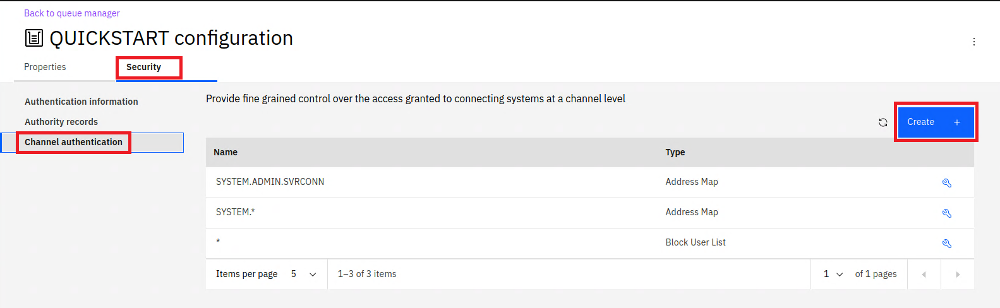

# Deploying IBM MQ for internal consumers

1. Within the Cloud Pak for Integration Platform Navigator click on Runtimes, and select Create Instance:  
   
1. Select the MQ Queue Manager tile:  
   
1. Select the _Quick start_ tile and click _Next_
1. Accept the license and and click _Create_ to deploy a new Queue Manager:  
   
1. You will be returned to the Runtime and Instances list, MQ will take a few seconds to deploy and the status will change to _Ready_. You may need to refresh the status by using the table refresh button:  
   
1. Select the newly created entry and you will be redirected to the MQ Console:  
   
1. Click on the manage button from the left menu to view the details of the Queue Manager:  
   
1. We will test MQ by sending a message to a queue, for this a new queue will be created, click on _Create +_:  
   
1. Select the _Local_ queue type:  
   
1. Fill in _app1_ as the Queue Name and click _Create_:  
   
1. A MQ channel needs to be defined for communication into MQ, select the _Communication_ tab, _App channels_ section and click _Create +_:  
   
1. Click _Next_
1. Enter _QUICKSTART_ as the channel name (as this will match the Queue Manager), and click _Create_:  
   
1. By default MQ is secure and will block all communication without explicit configuration.
   We will allow all communication for the newly created channel. Click on _Configuration_ in the top right:  
    
1. Select the _Security_ tab, _Channel authentication_ section and click _Create +_:  
   
1. We will create a channel auth record that blocks nobody and allows everyone. Select _Block_ from the pull down, and the _Final assigned user ID_ tile:  
   
1. Enter the following value:
   - Channel name: _QUICKSTART_
   - User list: nobody
1. Click on the _plus (+) sign_ next to the User list text field and then click on _Create +_:  
   
   

# Testing MQ

MQ has been deployed within the Cloud Pak for Integration to other containers deployed within the same Cluster. This deployment is NOT accessible externally. Depending on your scenario you can connect ACE / API Connect / Event Streams etc to MQ using the deployed service. This acts as an entry point into MQ within the Kubernetes Cluster. Assuming you used the defaults within the deployment the hostname will be _quickstart-cp4i-ibm-mq_. To verify the installation we will use an MQ client sample within the deployment.

1. Return to the OpenShift Console, navigate to Workload --> Pods and type _quicks_ in the search bar:  
   
   And select the _quickstart-cp4i-ibm0mq-0_ entry.
1. Change to the terminal tab which will automatically log you into the Queue Manager container:  
   
1. Run the following commands to send a message to app1queue:  
   export MQSERVER='QUICKSTART/TCP/quickstart-cp4i-ibm-mq(1414)'
   /opt/mqm/samp/bin/amqsputc app1 QUICKSTART
   
1. Return to the MQ Console and navigate back to the queue manager view by clicking on _Back to Queue Manager_:  
   
1. Select the app1 queue:  
   
1. You will then see the message sent:  
   
